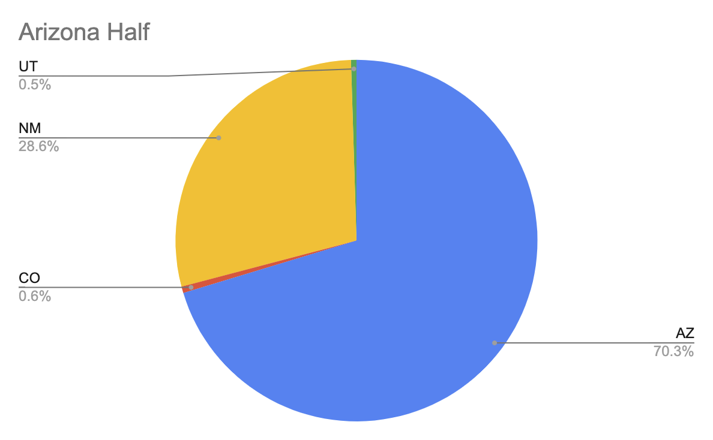
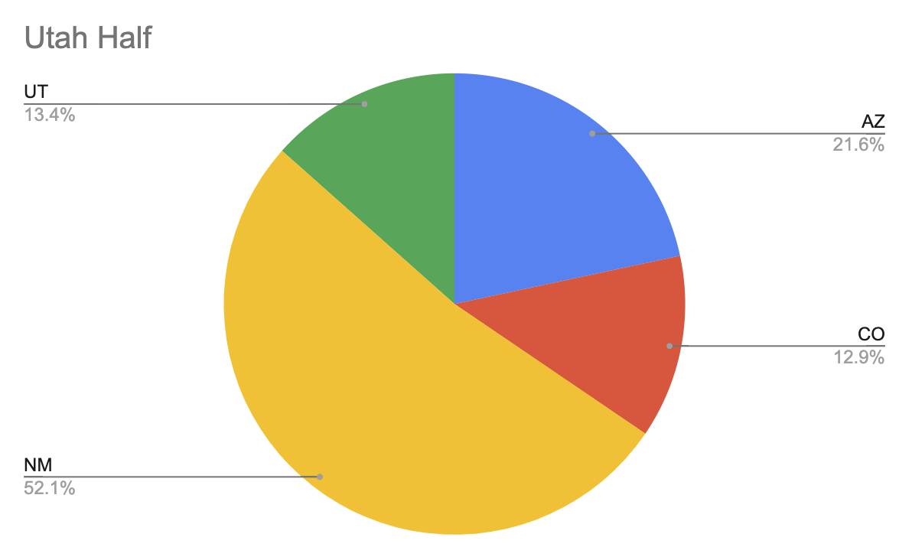
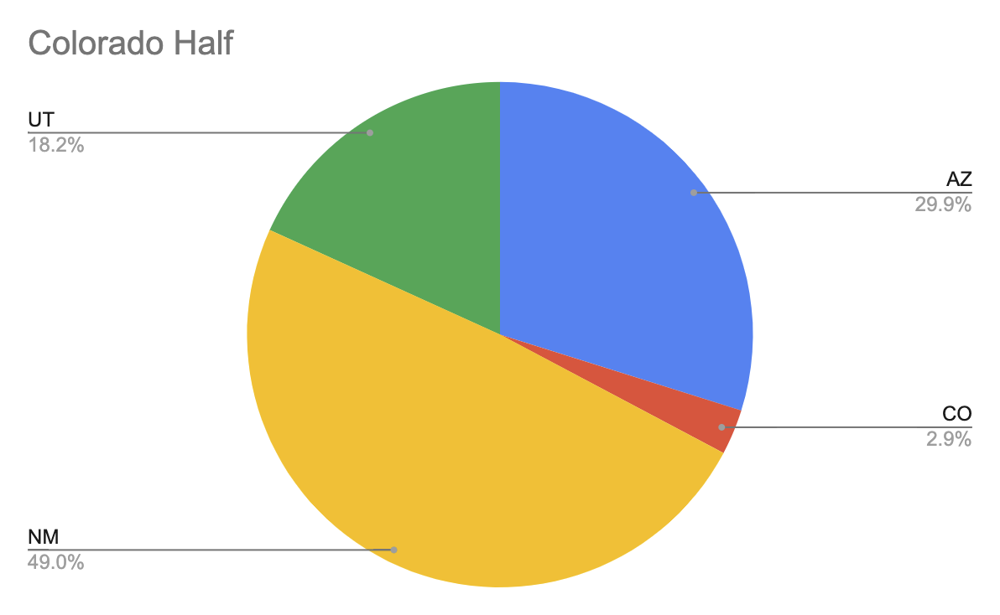

# Four Corners Quad Keyah Analysis

I ran the 2023 Four Corners Quad Keyah half marathon trail race series. After one of the races, some of the runners and
I were wondering how much distance was in each state. For example, on the "Arizona" race, how much distance was in
Arizona versus CO/UT/NM? This repo contains code/infra that performs this analysis. If you want to run it yourself, run
the following commands:

```bash
git clone https://github.com/scott113341/quad_keyah_analysis.git
cd quad_keyah_analysis
docker build -t quad_keyah_analysis:latest --progress=plain .
docker run quad_keyah_analysis:latest
```

The results:

<hr/>

<hr/>

<hr/>

<hr/>

<hr/>

Raw results:

```text
 race | state_portion | dist_in_state_meters | pct_in_state 
------+---------------+----------------------+--------------
 AZ   | AZ            |   15751.831466054255 | 70.28%
 AZ   | NM            |    6409.860547415962 | 28.60%
 AZ   | CO            |    129.9887587625881 | 0.58%
 AZ   | UT            |   109.39689320474987 | 0.48%
 
 UT   | NM            |   11193.153925639495 | 52.04%
 UT   | AZ            |    4653.707965723275 | 21.63%
 UT   | UT            |    2889.097089810013 | 13.43%
 UT   | CO            |     2763.37548137325 | 12.84%
 
 CO   | NM            |   10376.858680825299 | 49.01%
 CO   | AZ            |    6317.770766174279 | 29.84%
 CO   | UT            |   3852.1565097876764 | 18.19%
 CO   | CO            |    614.7305187950874 | 2.90%
 
 NM   | AZ            |   15072.669822329786 | 69.44%
 NM   | NM            |    6390.763213682219 | 29.44%
 NM   | CO            |   127.19158511044964 | 0.58%
 NM   | UT            |   110.86493184005019 | 0.51%
```

Note that the routes were from MY runs, which aren't necessarily what others ran (I definitely ran extra in the Arizona
and Colorado races) but it's Fine™. Links to my runs:
- [AZ](https://www.strava.com/activities/10344525778/overview)
- [UT](https://www.strava.com/activities/10349350045/overview)
- [CO](https://www.strava.com/activities/10354676948/overview)
- [NM](https://www.strava.com/activities/10360266031/overview)
